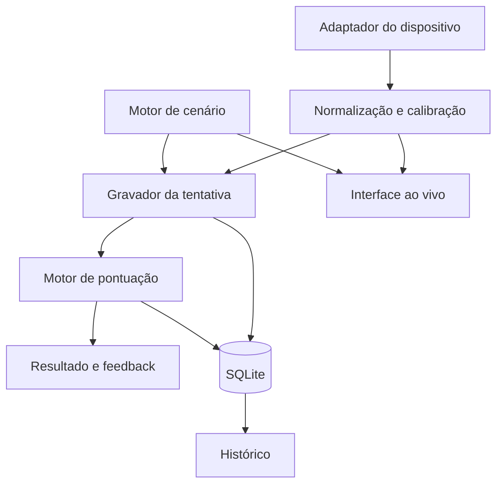
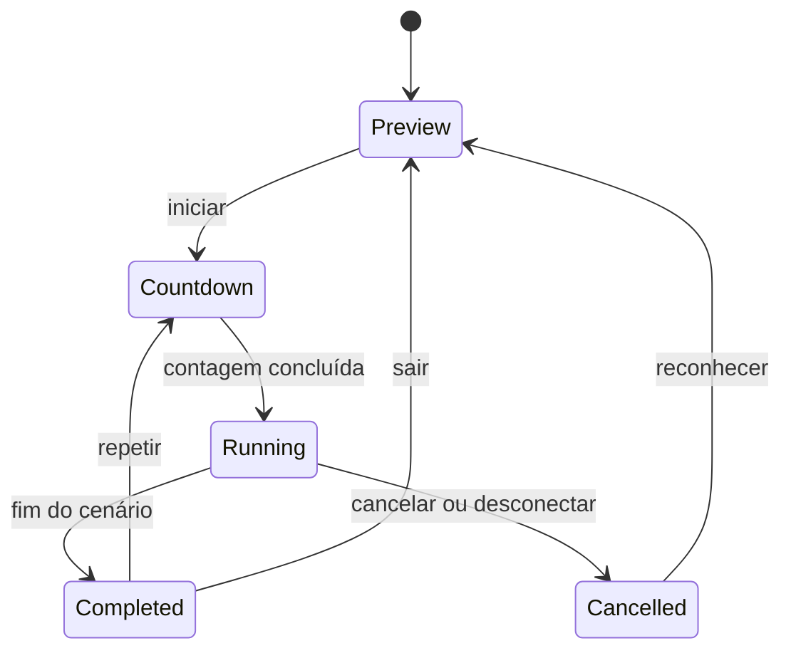

# Plano técnico — MVP do treinador de trail braking

**Status:** Em revisão  
**Spec relacionada:** [spec.md](spec.md)  
**Pesquisa relacionada:** [research.md](research.md)  

## 1. Objetivo desta fase

Definir uma arquitetura implementável e testável para atender à Spec 001, reduzindo o risco de integração com o Logitech G29 antes da construção das telas e do sistema completo de pontuação.

Este documento define decisões e fronteiras técnicas. A decomposição em tarefas executáveis será produzida somente após seu quality gate.

## 2. Contexto técnico

| Item | Decisão |
|---|---|
| Sistema operacional | Windows 10 e Windows 11, 64 bits |
| Linguagem | Python 3.12 |
| Interface | PySide6 / Qt Widgets |
| Entrada inicial | Pygame `joystick` / SDL |
| Frequência de aquisição | 120 Hz como alvo, 60 Hz como mínimo |
| Frequência visual | 60 FPS como alvo |
| Cálculo numérico | NumPy |
| Configuração de cenários | JSON validado por modelos tipados |
| Persistência | SQLite |
| Testes | pytest |
| Empacotamento | PyInstaller `onedir` |
| Conectividade | Aplicativo offline |

As versões exatas das dependências serão fixadas após o hardware spike, usando versões que possuam distribuição compatível com Python 3.12 e Windows 64 bits.

## 3. Arquitetura proposta

Será adotado um monólito desktop modular. Não haverá servidor local, API web ou processo separado no MVP.



### 3.1 Camadas

#### Domínio

Contém os modelos e regras que não dependem de Qt, Pygame ou SQLite:

- Calibração normalizada.
- Cenário e marcadores.
- Amostra de comando.
- Tentativa.
- Métricas.
- Relatório de pontuação.
- Regras de feedback.

#### Aplicação

Coordena os casos de uso:

- Detectar dispositivo.
- Calibrar e salvar perfil.
- Iniciar, cancelar e concluir tentativa.
- Repetir tentativa.
- Calcular resultado.
- Consultar histórico.

#### Infraestrutura

Implementa integrações substituíveis:

- Adaptador SDL/Pygame.
- Repositórios SQLite.
- Leitor de cenários JSON.
- Relógio monotônico.
- Logging local.

#### Interface

Implementada em PySide6:

- Seleção de dispositivo.
- Assistente de calibração.
- Lista de cenários.
- Treino com mapa 2D.
- Resultado com gráfico e mapa analisado.
- Histórico.

## 4. Estrutura inicial do projeto

```text
pilotagem-virtual/
├── pyproject.toml
├── README.md
├── src/
│   └── pilotagem_virtual/
│       ├── app/
│       ├── domain/
│       ├── input/
│       ├── scenarios/
│       ├── scoring/
│       ├── persistence/
│       └── ui/
├── resources/
│   └── scenarios/
├── tests/
│   ├── unit/
│   ├── integration/
│   └── hardware/
└── specs/
    └── 001-trail-braking-mvp/
```

O código usará o layout `src` para impedir imports acidentais do diretório de trabalho e facilitar empacotamento e testes.

## 5. Fluxo de aquisição

### 5.1 Adaptador de dispositivo

O domínio conhecerá apenas um contrato equivalente a:

- listar dispositivos;
- conectar por identificador estável;
- obter estado bruto;
- informar conexão e desconexão;
- listar botões disponíveis.

O adaptador SDL será a primeira implementação. Um adaptador falso será usado nos testes.

### 5.2 Worker de entrada

Um worker separado da thread da interface realizará aquisição periódica. A implementação candidata é um `QObject` movido para um `QThread`, mas o local exato do processamento de eventos SDL será confirmado pelo hardware spike.

Responsabilidades:

- processar eventos necessários do SDL;
- obter todos os eixos e botões;
- gerar timestamp monotônico;
- publicar o estado mais recente para a interface;
- enviar as amostras ao gravador durante uma tentativa;
- detectar perda do dispositivo.

### 5.3 Separação de frequências

- O worker tenta adquirir a 120 Hz.
- O gravador preserva as amostras adquiridas.
- A interface lê o estado mais recente a até 60 Hz.
- A pontuação é calculada somente após o encerramento da tentativa.

Nenhuma métrica dependerá da taxa de quadros da interface.

## 6. Calibração e normalização

### 6.1 Perfil salvo

Cada perfil de calibração conterá:

- Identificador do dispositivo.
- Nome e GUID.
- Mapeamento de eixo para volante, freio e acelerador.
- Valor mínimo e máximo de cada eixo.
- Centro do volante.
- Eixos invertidos.
- Deadzone do volante.
- Limite confortável do freio.
- Data e versão do perfil.

### 6.2 Saídas normalizadas

- Volante: `-1.0` a `1.0`.
- Freio: `0.0` a `1.0`.
- Acelerador: `0.0` a `1.0`.

Valores fora do intervalo serão limitados. O dado bruto poderá ser mantido durante o hardware spike, mas as tentativas do produto armazenarão comandos normalizados.

## 7. Motor de cenários

Cada cenário será um arquivo JSON imutável e versionado com:

- metadados;
- duração;
- direção da curva;
- geometria normalizada do mapa;
- marcadores temporais;
- curvas-alvo de freio, volante e acelerador;
- tolerâncias por fase;
- pesos de pontuação;
- regras de feedback;
- versão da fórmula de pontuação.

As curvas-alvo serão definidas por keyframes em progresso normalizado de `0.0` a `1.0`. O motor interpolará os valores entre os keyframes.

O motor de cenário funciona como máquina de estados:



## 8. Mapa 2D

O mapa utilizará coordenadas normalizadas independentes da resolução. A interface converterá a geometria do cenário para um `QPainterPath` e a exibirá em uma `QGraphicsScene`.

Durante a tentativa:

- o indicador avança segundo o progresso temporal;
- o segmento ativo recebe destaque;
- barras ou medidores mostram os comandos atuais;
- marcadores permanecem legíveis em curvas para ambos os lados.

Após a tentativa:

- o mapa mantém os marcadores ideais;
- pontos reais de frenagem, turn-in, liberação e aceleração são sobrepostos;
- trechos recebem estado correto, aceitável ou incorreto com cor, padrão e texto.

## 9. Gravação da tentativa

Cada amostra conterá:

- deslocamento em nanossegundos desde o início;
- progresso normalizado do cenário;
- volante normalizado;
- freio normalizado;
- acelerador normalizado;
- estado de conexão.

O gravador mantém as amostras em memória durante o exercício e realiza uma gravação transacional ao concluir. Tentativas canceladas poderão ser registradas apenas como diagnóstico, sem entrar no histórico de pontuação.

## 10. Motor de pontuação

### 10.1 Princípios

- Determinístico.
- Independente da interface.
- Versionado.
- Testável com séries sintéticas.
- Explicável por métricas intermediárias.
- Relativo ao cenário, não a uma alegação de física universal.

### 10.2 Pipeline

1. Validar integridade e duração da tentativa.
2. Reamostrar alvo e execução em uma grade temporal comum.
3. Aplicar apenas o filtro de ruído aprovado pelo hardware spike.
4. Detectar eventos reais: frenagem, turn-in, liberação e aceleração.
5. Calcular métricas brutas.
6. Converter métricas em subpontuações de 0 a 100 usando tolerâncias do cenário.
7. Calcular média ponderada.
8. Selecionar o feedback mais relevante pela maior penalidade normalizada.
9. Produzir relatório com versão da fórmula.

### 10.3 Subpontuações iniciais

- Pressão inicial.
- Liberação do freio.
- Sincronização freio-volante.
- Suavidade.
- Acelerador na saída.

Pesos e tolerâncias continuarão configuráveis até serem testados com amostras reais do G29.

### 10.4 Consistência

A consistência será calculada somente entre tentativas do mesmo cenário e mesma versão de pontuação. A medida candidata é a dispersão das subpontuações e dos principais eventos nas últimas cinco tentativas válidas.

## 11. Persistência

### 11.1 Arquivos do aplicativo

- Cenários oficiais: JSON somente leitura no pacote.
- Banco do usuário: SQLite no diretório local de dados do aplicativo.
- Logs: arquivos locais rotativos sem conteúdo sensível.

### 11.2 Entidades mínimas

| Entidade | Finalidade |
|---|---|
| `device_profiles` | Mapeamento e calibração do dispositivo |
| `attempts` | Metadados e notas da tentativa |
| `input_samples` | Série temporal normalizada |
| `score_components` | Subpontuações e métricas intermediárias |

O banco terá versão de esquema e migrações incrementais. Escritas de tentativa, amostras e pontuações ocorrerão na mesma transação.

## 12. Interface e navegação

### 12.1 Telas do MVP

1. Inicialização e estado do dispositivo.
2. Calibração.
3. Seleção de cenário.
4. Preview do exercício.
5. Tentativa.
6. Resultado.
7. Histórico.

### 12.2 Layout da tentativa

- Mapa como elemento principal.
- Indicadores de freio, acelerador e volante visíveis sem cobrir o trajeto.
- Fase atual e contagem regressiva em alta hierarquia.
- Suporte a janela redimensionável e tela cheia.
- Adaptação explícita para 16:9 e 21:9.

### 12.3 Layout do resultado

- Nota geral e principal feedback.
- Mapa analisado.
- Gráfico alvo versus execução.
- Subpontuações.
- Ações de repetir, trocar cenário e abrir histórico.

## 13. Tratamento de falhas

- Dispositivo ausente: bloquear início e oferecer nova detecção.
- Desconexão: cancelar tentativa e preservar dados anteriores.
- Cenário inválido: não listar o cenário e registrar erro técnico.
- Banco indisponível: impedir perda silenciosa e informar que a tentativa não foi salva.
- Falha de pontuação: preservar tentativa bruta para reprocessamento.
- Queda de frequência: registrar telemetria de diagnóstico e invalidar a tentativa se ficar abaixo do mínimo definido.

## 14. Estratégia de testes

### 14.1 Unitários

- Normalização, inversão e deadzone.
- Interpolação de cenários.
- Transições da máquina de estados.
- Detecção de eventos.
- Pontuação com tentativa perfeita e erros controlados.
- Seleção de feedback.
- Cálculo de consistência.

### 14.2 Integração

- Adaptador falso → tentativa → pontuação → SQLite.
- Carregamento e validação de todos os cenários empacotados.
- Migrações do banco.
- Desconexão durante uma tentativa.

### 14.3 Interface

- Navegação pelos fluxos essenciais.
- Redimensionamento 1920 × 1080 e 2560 × 1080.
- Estados vazio, carregando, conectado, desconectado e erro.

### 14.4 Hardware manual

- Detecção do G29.
- Mapeamento e calibração dos eixos.
- Botões.
- Ruído dos sensores.
- 30 tentativas consecutivas.
- Desconexão e reconexão.
- Execução do pacote gerado sem ambiente Python instalado.

## 15. Empacotamento e distribuição

- Build inicial somente para Windows 64 bits.
- PyInstaller em modo `onedir`.
- Cenários e recursos incluídos explicitamente no arquivo de build.
- Banco e logs fora do diretório do executável.
- Build reproduzível por comando documentado.
- Artefato testado em máquina ou usuário do Windows sem ambiente de desenvolvimento.

Assinatura digital e instalador ficam fora do primeiro build interno.

## 16. Observabilidade local

O aplicativo registrará localmente:

- inicialização e versão;
- detecção e perda de dispositivos;
- frequência efetiva de amostragem;
- cenário e versão de pontuação;
- erros de persistência e carregamento.

Valores detalhados de pedais e volante não serão escritos continuamente nos logs; pertencem apenas às tentativas salvas.

## 17. Sequência de implementação proposta

1. Estrutura do projeto e automação de testes.
2. Hardware spike do G29.
3. Contrato de dispositivo, adaptador falso e adaptador SDL.
4. Calibração e persistência do perfil.
5. Motor de cenário e primeiro mapa 2D.
6. Gravação da tentativa.
7. Pontuação determinística e feedback.
8. Tela de resultado.
9. Histórico e consistência.
10. Empacotamento e validação do MVP.

A fase seguinte decomporá essa sequência em tarefas pequenas com dependências e critérios de conclusão.

## 18. Rastreabilidade

| Área técnica | Requisitos atendidos |
|---|---|
| Dispositivo e calibração | RF-001 a RF-008, CA-001, CA-006 |
| Cenário e mapa | RF-009 a RF-015, CA-002, CA-003 |
| Orquestração da tentativa | RF-016 a RF-022, CA-002, CA-005 |
| Pontuação e resultado | RF-023 a RF-030, CA-004 |
| Persistência e histórico | RF-031 a RF-035, CA-007 |
| Frequência e interface | RNF-001 a RNF-008 |

## 19. Riscos técnicos e mitigação

| Risco | Impacto | Mitigação |
|---|---|---|
| Eixos do G29 variam com driver | Alto | Descoberta por calibração e hardware spike antes das telas completas |
| Eventos SDL conflitam com o loop Qt | Alto | Testar thread e bombeamento no spike; manter adaptador substituível |
| Ruído gera penalidade falsa | Alto | Medir ruído real antes de definir filtro e tolerâncias |
| UI interfere na amostragem | Alto | Separar aquisição, gravação e renderização |
| Empacotamento omite plugins Qt/SDL | Médio | Teste automatizado de build e validação em ambiente limpo |
| Pontuação parece arbitrária | Alto | Expor submétricas, versionar fórmula e usar casos sintéticos conhecidos |
| JSON de cenário inválido | Médio | Validação na inicialização e testes de contrato |

## 20. Decisões adiadas

- Integração com simuladores.
- Force feedback.
- Editor de cenários.
- Sincronização em nuvem.
- Instalador e assinatura de código.
- Suporte oficial a outros volantes.
- Física que altera velocidade e trajetória.

## 21. Quality gate do plano técnico

O plano estará aprovado para a decomposição em tarefas quando:

- Stack e arquitetura modular forem aceitas.
- Hardware spike for aceito como primeiro risco a resolver.
- Frequências de aquisição e renderização forem aceitas como metas.
- Estratégias de cenário, pontuação e persistência forem aceitas.
- A separação entre modo guiado e física de veículo continuar explícita.
- Os requisitos da spec estiverem rastreados para componentes e testes.
- Não houver decisão técnica bloqueante sem estratégia de validação.
